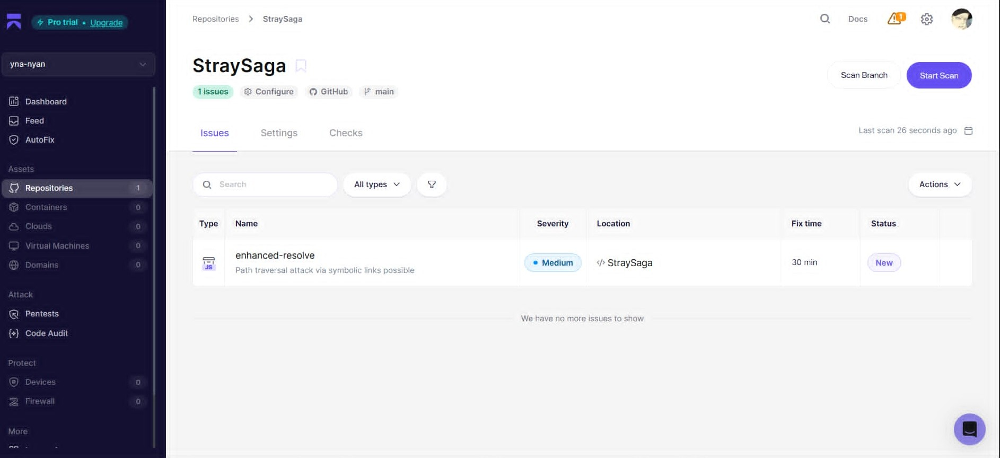
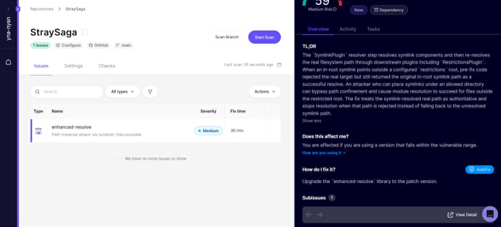

#### #hackthekitty 2026

# Project Report: StraySaga

**Team:** Sakina and Saira  
**Reference ID:** 6QKQUMDN  
**Demo Link:** [Drive Video](https://drive.google.com/file/d/1Ky2AF3rFHVj-lH8858bp7bdWqKsXOFUq/view?usp=sharing)  
**GitHub:** [yna-nyan/StraySaga](https://github.com/yna-nyan/StraySaga)  

---

## 1. Executive Summary
StraySaga is a browser-based RPG where the player takes on the role of a stray cat navigating a city neighborhood. Players choose their cat's archetype, explore an interactive map, encounter narrative scenarios, and manage survival stats (Energy, Warmth, Trust) while collecting kibble and searching for a safe home — or facing the consequences of the street.

---

## 2. Project Overview

### 2a. Why we're building what we're building
StraySaga was built as a public awareness campaign for the "adopt, don't buy" message. Rather than presenting statistics or a lecture, the project turns the message into an interactive, emotional experience: by making players live through a stray cat's daily struggle for warmth, food, and trust, the game builds empathy for real strays and nudges players toward adoption over buying from breeders or pet stores.

### 2b. How it relates to the theme
The project channels the hackathon's spirit of building for good into stray animal shelter advocacy, using game mechanics (survival stats, exploration, narrative choices) as a vehicle for a real-world social message, and pairing that message with concrete calls to action such as local adoption tips and real stray cat adoption stories in the ending credits.

### 2c. Target Audience
Anyone. StraySaga is designed as a casual, browser-playable experience with broad appeal, no installs, no account, and an accessible narrative, so it can reach as wide an audience as possible and maximize the reach of its adoption message. 

---

## 3. Key Features
* **Cat Character Selection** — Four unique cat archetypes (Calico, Grey, Bombay Black, Tuxedo), custom naming, starting attributes, and a persistent "Hope" wallet (`localStorage`) that carries a warmth boost into future playthroughs after defeat.
* **Immersive Narrative Prologue** — Typographic story slides and early narrative choices (hide, run, wait) that shape the cat's starting survival stats.
* **Hybrid 3D/2D Exploration Map** — A Three.js WebGL 3D map with camera tracking and animated entities, layered under a React/HTML HUD showing survival bars, coordinates, quests, and inventory; supports both keyboard movement and click-to-pathfind navigation.
* **Scenario Dialogues (Visual Novel Engine)** — Branching dialogue at waypoints (Comrades, Rival, Food, Pet) that affect stats, with item drops feeding into a survival inventory system.
* **Locked End-Game Objective** — Ms. Eleanor's cottage stays locked until all four primary landmarks are explored, ensuring the full story and message are experienced before the game can end.
* **Ending Screen & Credits** — A stats recap, a choice summary, and a standalone Credits component featuring local adoption tips and real stories of adopted stray cats alongside development and asset attributions.

---

## 4. Technology Stack

| Layer | Technology | Purpose |
| :--- | :--- | :--- |
| **User Interface (UI)** | React (v18) | Component state rendering, routing transitions, and UI overlays. |
| **Graphics Engine** | Three.js (WebGL) | Renders the 3D scene, entities, terrain, camera movement, and custom canvas textures. |
| **Layout & Styling** | Tailwind CSS | Custom fonts, HSL palettes, glassmorphism, responsive grids, and typography. |
| **Animation System** | Framer Motion (`motion/react`) | Smooth HUD popups, dialog slides, and accordion transitions. |
| **Vector Icons** | Lucide React | UI iconography (GitHub, volume controls, stats, alerts). |
| **Audio Processing** | HTML5 Audio API | Procedural play loops, volume adjustments, and contextual SFX (hissing, purring, walking). |
| **Build & Bundler** | Vite | Fast local hot reloading and optimized production bundles. |

---

## 5. Technical Architecture
The architecture separates UI state management from WebGL rendering using a bridge model: React owns high-level game state, while an OOP-based `MapEngine` handles all 3D interaction and reports coordinate/event callbacks back into the React context.

### State & Render Flow
`App.tsx` (React root state) passes status and coordinates down to `GameMap.tsx`, which renders the HUD and overlay and instantiates `MapEngine.ts`, the 3D controller. `MapEngine.ts` reads keyboard/click input via `InputManager.ts` and spawns and updates `PlayerEntity.ts`, `WaypointEntity.ts`, and `TreatEntity.ts`. Player movement triggers alternating step events that render a fading 3D footprint trail. Collision and proximity callbacks flow back from `MapEngine.ts` to `GameMap.tsx`, which calls `onVisitWaypoint` back up to `App.tsx`. `App.tsx` then transitions state to open `ScenarioDialog.tsx`, the visual novel dialogue engine; once a dialogue completes, control returns to `App.tsx` to resume exploration.

### Component Breakdown
* `App.tsx` (Global State Manager) — Maintains `gameState`, `catStatus` (energy, warmth, trust), inventory, and persistent hope wallet storage.
* `MapEngine.ts` (Three.js Wrapper) — Coordinates the WebGL context, ticking, lighting, cameras, maps, and entity disposal.
* `BaseEntity.ts` (Entity Interface) — Standardizes OOP entities so they share coordinate logic and scene removal/cleanup.
* `Credits.tsx` (Attribution Panel) — An independent component holding cat biographies and asset attributions.

---

## 6. Testing Matrix

| Feature / Flow | Steps | Expected Result | Pass / Fail |
| :--- | :--- | :--- | :--- |
| **Selection (TC-001)** | Enter name, choose Black Cat, click start. | Transitions to Prologue; starting stats match Bombay Black baseline. | Pass |
| **Selection (TC-002)** | Click the GitHub badge. | Opens the yna-nyan/StraySaga repository in a new tab. | Pass |
| **Prologue (TC-003)** | Click through dialogue and make choice options. | Dialogue progresses without breaking; choices modify starting stats; exits to Map screen. | Pass |
| **Exploration (TC-004)** | Press arrow keys / WASD to move the cat. | Cat moves on the 3D map, plays step audio, and leaves fading paw prints. | Pass |
| **Exploration (TC-005)** | Click a nearby Waypoint Node (e.g. Food). | Cat auto-travels to the target, HUD coordinates update, and a dialogue scenario triggers. | Pass |
| **Exploration (TC-006)** | Walk over a glowing gold paw-print item (Treat). | Treat is collected immediately, plays a purr SFX, and is added to inventory. | Pass |
| **Inventory (TC-007)** | Open Quests menu, click Kibble or Discarded Fish. | Item is consumed, Energy/Warmth increase correctly, item is removed from the loot slot. | Pass |
| **Quest System (TC-008)** | Click the Cottage steps before visiting all 4 targets. | Alert warns the cottage is locked; hiss audio feedback plays. | Pass |
| **Quest System (TC-009)** | Visit all 4 landmarks (4/4), then click the Cottage steps. | Cottage porch unlocks; entering triggers the ending sequence. | Pass |
| **Game Over (TC-010)** | Idle or walk until Energy drops to 0. | Defeat ending triggers, Hope points are awarded based on trust and stored in localStorage. | Pass |
| **Ending Screen (TC-011)** | Scroll to the bottom of the Victory/Defeat screen. | Credits section shows local adoption profiles, developer credits, and audio/media attributions. | Pass |
| **Sound Controls (TC-012)** | Click the Music Controller mute button and adjust the volume slider. | Soundtracks toggle instantly and fade according to the volume change. | Pass |

---

## 7. Aikido Pentesting Report

---

## 8. Future Improvements
- [ ] Improve and expand the game logic (more scenarios, deeper stat interactions, additional endings).
- [ ] Add more in-game instructions and guidance on real-world cat adoption.
- [ ] Improve the overall UI/UX polish and accessibility.

---

## 9. Tools You Used
- [ ] Kiro AI — AI coding assistant used during development.
- [ ] Claude — AI coding assistant used during development.
- [ ] ChatGPT — used for image generation/assets.

---

## 11. Learnings & Takeaways
Building something for a cause we genuinely care about made the process fun rather than a grind. Technically, we learned how Three.js rendering works under the hood while researching the 3D engine — even though we ultimately didn't end up using Three.js in the shipped build.

---

## 12. Acknowledgments
Thanks to Kiro AI and Claude for speeding up development, and to Gemini for its free-tier API access used during the project.

---

## Submission Checklist
- [ ] Video demo (HD or at least 720p)
- [ ] README.md (prerequisites, run instructions, configuration)
- [ ] Project report (this document, in `documentation/`)
- [ ] Source code in `src/`
- [ ] No unrelated files, executables, auto-generated code, or package folders (e.g. `node_modules/`, `build/`, `dist/`, `vendor/`)